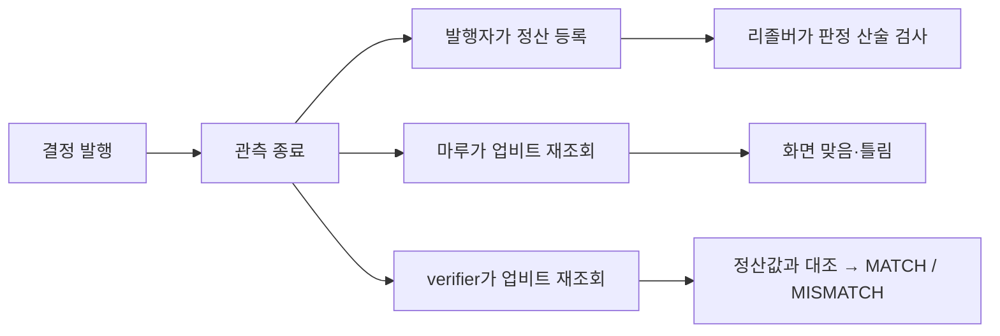

# 무엇을 하는 제품인가

마루는 GIWA Sepolia에 있는 POI 결정 기록을 읽어 보여주는 **소비자 화면**이다.
조회는 전부 지갑 없이 되고, 판단 발행(`#/write`)만 지갑이 필요하다.

```
피드                프로필                발행자별 기록
#/feed         →    #/p/<address>   →     같은 지갑의 결정만 시간순
결정 목록            누르면 이동            승률·집계는 없다

결정 상세            검증
#/d/<uid>      →    #/verify/<uid>
조건·정산 상태        POI verifier로 재계산 안내
```

## 피드가 보여주는 것

여러 지갑의 결정을 시간 역순으로 나열한다. 각 줄에 상태(해당없음·대기·관측중·
등록대기·기한초과·등록완료·지연등록 중 하나), 발행자, 조건 문장, 관측 구간(UTC)이
있다. 도장 검증 스냅샷이 있으면 라벨이 붙고, 없으면 「도장 미검증」이 보인다.

## 필터의 범위

두 조건으로 거른다: **도장 검증 지갑만**, **발행자별 활성 정산 최소 건수**.
둘 다 URL 쿼리에 실려 링크로 공유된다(`?verified=1&match=2`).

`match`는 공유 링크 호환을 위한 파라미터 이름이다. **실제로 거르는 값은
MATCH 판정 수가 아니라 발행자별 활성 정산 건수다.** 이 필터는 결정 하나하나가
아니라 발행자를 통과시킨다. 활성 정산이 N건 이상인 발행자를 남기고, 그
발행자의 미정산 결정도 함께 보인다. 정산 등록은 관측값 일치를 보장하지
않는다. 걸러진 결과를 봐도 각 판단은 직접 검증해야 한다.

## 판정의 범위

관측이 끝난 결정에는 업비트 1분봉으로 다시 계산한 맞음·틀림이 붙는다.
**이 판정은 화면이 재계산한 것이지 온체인 기록이 아니다.** 틀린 것도 숨기지
않고 그대로 보여준다. 자세한 규칙은 [맞고 틀림: 업비트 재계산](../design/verdict.md)에 있다.

## 판단 한 건의 일생: 관측이 끝난 뒤 갈래가 셋



렌더가 안 될 경우를 대비해 같은 내용을 문장으로도 남긴다. 결정이 발행되고
관측 구간이 끝나면 그 뒤로 서로 독립된 세 갈래가 동시에 존재할 수 있다.
발행자가 정산을 등록하면 리졸버가 그 산술만 검사하고, 마루 화면은 업비트를
다시 조회해 맞음·틀림을 표시하고, verifier는 업비트 재조회값과 등록된
정산값을 대조해 MATCH나 MISMATCH를 낸다. 셋은 서로 다른 질문에 답하므로
한 갈래의 결과가 다른 갈래의 결과를 함의하지 않는다. 자세한 구분은
[무엇이 증명되고 무엇이 안 되나](../problem/what-is-proven.md)에 있다.

## 지갑 없이 되는 넷 + 발행 화면 하나

피드 · 프로필 · 결정 상세 · 검증, 지갑 없이 되는 조회 화면은 이 넷이 전부다.
판단 발행(`#/write`)은 별도 화면이고 지갑이 있을 때만 쓸 수 있으며, 없으면
막다른 길 대신 연결 안내가 뜬다.
