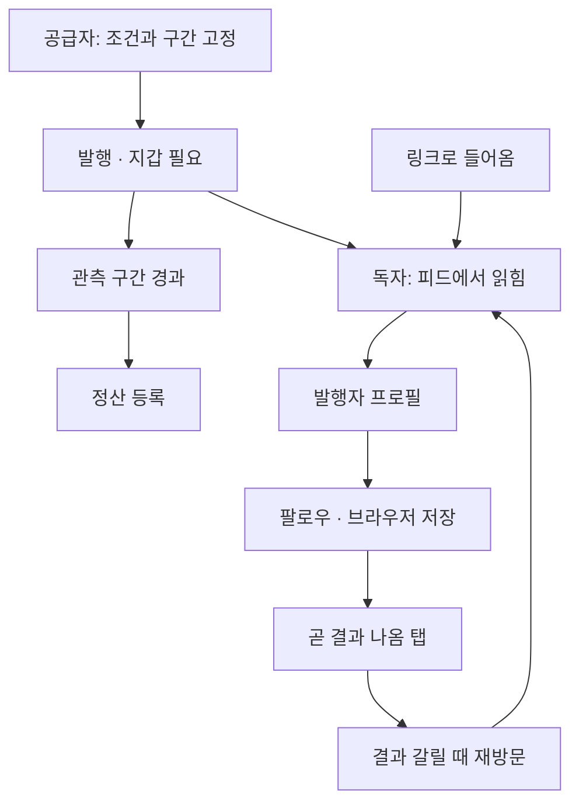

# 사용자 시나리오

> **실사용자는 없다.** 아래는 가상의 여정이다. 다만 **여기 나오는 화면과
> 동작은 전부 지금 배포된 것**이고, 없는 기능은 쓰지 않았다
> (알림 없음 · 온체인 팔로우 없음 · 순위 없음 · 코멘트 없음).

마루에는 두 부류가 있고 하는 일이 다르다. 자세한 구분은
[시장](../market/market.md)에 있다.

---

## 시나리오 A — 독자: 링크 하나로 들어온다

**상황.** 트레이딩 단체방에 누군가 링크를 던진다.
`.../#/feed?verified=1&match=2` — 「도장 검증 지갑 · 활성 정산 2건 이상」이
걸린 상태다. **필터가 URL에 실려 있어서** 링크를 받은 사람이 같은 화면을 본다.

| 무엇을 하나 | 무엇이 보이나 |
|---|---|
| 링크를 연다 | 로그인도 지갑 연결도 없이 바로 피드. 상단에 필터가 켜진 상태로 표시 |
| 한 카드를 본다 | 조건 문장 · 관측 구간(UTC) · 발행자 주소 · 도장 라벨. 관측이 끝났으면 **「화면 재계산 맞음/틀림」** |
| **틀린 카드**를 본다 | 지워지지 않고 맞은 카드와 **같은 줄에 그대로** 있다 |
| 발행자 주소를 누른다 | `#/p/<address>` — 그 지갑의 결정만 시간순. **승률·점수는 없다** |

**여기서 이 사람이 확인하는 것**은 「이 사람이 잘 맞히나」가 아니다.
그건 순위가 있어야 하는 질문이고 마루에는 없다.
확인되는 것은 **「이 사람이 결과를 알기 전에 무슨 말을 했고, 그게 남아 있나」다**.

## 시나리오 B — 독자: 다시 오는 이유

**상황.** 팔로우해 둔 사람의 판단이 아직 관측 중이다.

1. **팔로우** 버튼을 누른다 → 브라우저에 저장된다.
   **온체인 기록이 아니고**, 화면에도 그렇게 적혀 있다
   ([팔로우와 탭](../design/follow.md)).
2. **「곧 결과 나옴」 탭**으로 간다 → 아직 창이 안 닫힌 판단이
   **마감 임박 순**으로 뜬다.
3. 구간이 끝난 뒤 다시 들어온다 → 같은 카드에 **맞음·틀림이 붙어 있다.**

**이것이 재방문 동인이다.** 알림이 없으므로 사람이 직접 와야 하고,
「곧 결과 나옴」 탭은 **언제 오면 되는지**를 알려주는 장치다.

> **한계.** 알림은 만들지 않았다. 지금은 사용자가 기억해서 다시 와야 한다.

## 시나리오 C — 독자: 의심스러울 때 끝까지 파고든다

**상황.** 「이 사람 판단이 맞았다고 화면에 뜨는데, 진짜인가?」

| 단계 | 무엇을 |
|---|---|
| 1 | 카드의 **이유 원문**을 본다. 「이 문장의 해시가 결정에 기록된 커밋과 일치합니다」가 붙어 있다 — [해시 대조](../design/reason.md) |
| 2 | **결정 열기** → `#/d/<uid>`. 조건·관측 구간·정산 상태·부모 결정 |
| 3 | **이 결정 검증하기** → `#/verify/<uid>`. POI 검증기 명령어를 그대로 복사 |
| 4 | 직접 돌린다 → 종료코드 `0`이면 MATCH — [검증기로 잇기](../verify/cli.md) |

**4단계는 마루를 안 믿어도 된다.** 마루가 계산한 값이 아니라 **POI 검증기가
업비트에서 다시 받아 계산한 값**과 온체인 정산을 대조한다.

> **주의.** 검증기 `MATCH`는 「예측이 맞았다」가 아니라
> **「등록된 관측값이 재계산과 같다」다**. 화면이 「틀림」으로 표시한 결정도
> 검증기에서는 MATCH가 나온다 — 서로 다른 질문이다.

## 시나리오 D — 공급자: 판단 하나를 고정한다

**상황.** 「이번엔 안 오른다」고 생각하고, 그걸 **결과 전에** 남기고 싶다.

| 단계 | 무엇을 | 지갑 |
|---|---|---|
| 1 | `#/write`에서 지갑 연결 | **필요** |
| 2 | 조건을 고른다 — 지표 · 부등호 · 임계값 | |
| 3 | **관측 구간**을 고른다 (10분 / 1시간 / 3시간) | |
| 4 | 이유를 쓴다 → **해시만 먼저** 온체인에 올라간다 | |
| 5 | attest 서명 | **필요** |

여기서 **되돌릴 수 없게 되는 것**: 조건 · 관측 구간 · 이유의 해시.
발행자가 나중에 조건을 바꾸거나 판단을 지울 수 없다.

**관측 구간이 끝나면** 피드의 그 카드에 맞음·틀림이 붙는다.
발행자가 정하는 게 아니라 **화면이 계산한다.**

## 시나리오 E — 공급자: 생각이 바뀌었다

**상황.** 앞서 「안 오른다」고 했는데 판이 바뀌었다.

지우지 않는다. **새 판단을 발행하면서 앞 결정을 부모로 지정**한다.
카드에 **스레드 배지**가 붙고, 상세에서 이전 판단으로 이어진다
([입장 변경 이력](../design/thread.md)).

**앞의 판단은 그대로 남는다.** 바뀌었다는 사실 자체가 기록이 된다.
이게 「맞은 것만 골라 남기는」 것과 다른 지점이다.

---

## 이 여정에서 아직 안 되는 것

| | 지금 |
|---|---|
| 알림 | 없다. 결과가 나와도 알려주지 않는다 |
| 온체인 팔로우 | 없다. 브라우저를 지우면 팔로우도 사라진다 |
| 순위·집계 | 없다. 「누가 잘 맞히나」에는 답하지 않는다 — [이유](../problem/sns.md) |
| 코멘트 | 없다. 반응을 남길 곳이 없다 |
| 신고·차단 | 없다 — [운영·안전](../limits/not-done.md) |

전부 [로드맵](../limits/roadmap.md)에 선행 조건과 함께 적어 두었다.
